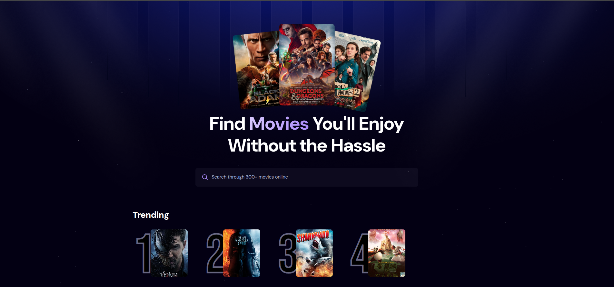

<div align="center">
  <br />
    <a href="https://youtu.be/mF2pZ1-7S74?feature=shared" target="_blank">
      
    </a>
  <br />

  <div>
    
    
    
  </div>

  <h3 align="center">A Real-world Movie App with React, TailwindCss and Appwrite</h3>
</div>

[](https://app.netlify.com/projects/movie-ges/deploys)

## 📋 <a name="table">Table of Contents</a>

1. 🤖 [Introduction](#introduction)
2. ⚙️ [Tech Stack](#tech-stack)
3. 🔋 [Features](#features)
4. 🤸 [Quick Start](#quick-start)

## 🤖 Introduction

Built with React 19 and Tailwind CSS, this application provides a seamless browsing experience for movie enthusiasts. It integrates with the TMDB API to fetch real-time movie data and leverages Appwrite to track and display trending movies based on user searches.

## ⚙️ Tech Stack<

- **React 19**: The latest version of the popular JavaScript library for building user interfaces.
- **Tailwind CSS**: A utility-first CSS framework for rapid UI development.
- **Appwrite**: A backend-as-a-service platform used for storing and retrieving trending movie data.
- **TMDB API**: A comprehensive movie database used to fetch detailed movie information.

## 🔋 Features

👉 **Search Functionality**: Users can search for movies through a dynamic search bar, which updates the movie list in real-time.

👉 **Trending Movies**: Displays a list of trending movies based on search frequency, stored and retrieved from Appwrite.

👉 **Movie Details**: Provides essential information about each movie, including its poster, rating, and release date.

👉 **Responsive Design**: Ensuring a smooth and consistent experience across various devices, from desktops to mobile phones.

## 🤸 Quick Start

Follow these steps to set up the project locally on your machine.

**Prerequisites**

Make sure you have the following installed on your machine:

- [Git](https://git-scm.com/)
- [Node.js](https://nodejs.org/en)
- [bun](https://bun.com/) (Package Manager)

**Cloning the Repository**

```bash
git clone [https://github.com/IT-WIBRC/movies-app.git](https://github.com/IT-WIBRC/movies-app.git)
cd movies-app
```

**Installation**

Install the project dependencies using npm:

```bash
bun install
```

**Set Up Environment Variables**

Create a new file named `.env` in the root of your project and add the following content:

```env
VITE_TMDB_API_KEY=
VITE_API_BASE_URL=

VITE_APPWRITE_DATABASE_ID=
VITE_APPWRITE_TABLE_ID=

VITE_APPWRITE_PROJECT_ID =
VITE_APPWRITE_PROJECT_NAME =
VITE_APPWRITE_ENDPOINT =


VITE_BASE_POSTER_URL=

VITE_NETLIFY_FUNCTIONS_BASE_URL=http://localhost:8888/.netlify/functions
```

Replace the placeholder values with your actual TMDB and Appwrite credentials.

**Running the Project**

```bash
bun run serve
```

Open [http://localhost:8888](http://localhost:8888) in your browser to view the project.

## Preview


